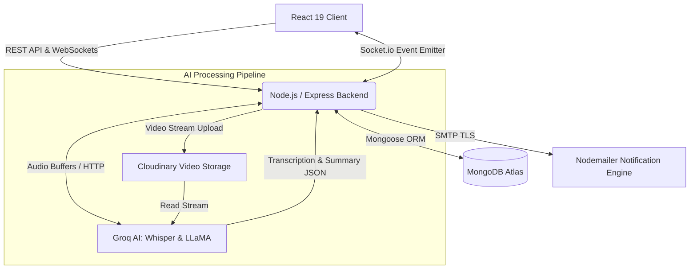

<div align="center">
  
  <h1>SyncLoop</h1>
  <p><strong>An Asynchronous Video Communication Platform for Distributed Engineering Teams</strong></p>
  
  <p>
    <a href="https://react.dev/"></a>
    <a href="https://tailwindcss.com/"></a>
    <a href="https://nodejs.org/"></a>
    <a href="https://www.mongodb.com/"></a>
    <a href="https://socket.io/"></a>
  </p>
  
  <p>
    <a href="#features">Features</a> •
    <a href="#system-architecture">Architecture</a> •
    <a href="#screenshots">Screenshots</a> •
    <a href="#getting-started">Getting Started</a> •
    <a href="#deployment">Deployment</a>
  </p>
</div>

---

**SyncLoop** is a full-stack web application designed to streamline communication in remote and distributed teams. By replacing synchronous meetings with structured, asynchronous video threads, teams can communicate effectively across time zones. The platform leverages modern artificial intelligence via Groq to automatically transcribe and summarize video updates, generating actionable insights instantly.

---

## Features

- **Asynchronous Video Collaboration:** Record webcam and screen-capture updates directly within the browser using the native MediaRecorder API.
- **AI-Powered Insights:** Video audio is processed in real-time, transcribed via `whisper-large-v3`, and summarized using `llama-3.3-70b-versatile` to extract immediate context and action items.
- **Conversational Meeting Intelligence:** An integrated AI assistant allows users to query the context of the entire meeting thread ("List my action items" or "What was the decision on X?").
- **Secure Workspace Management:** Role-based access control (RBAC) enabling users to create private workspaces, invite team members, and securely manage access to meeting threads.
- **Threaded Communication:** Deeply nested text comments on specific video replies to maintain organized and contextual discussions.
- **Real-Time Synchronization:** WebSockets via Socket.io ensure immediate state propagation across all connected clients for replies and comments.
- **Automated Notifications:** Event-driven email alerts and in-app toast notifications keep team members informed of critical updates.
- **Next-Gen Premium UI:** A complete structural redesign featuring an immersive "Linear-inspired" dark mode, floating glassmorphism layouts, a dynamic bento-box dashboard, and cinematic video elements.

---

## System Architecture

SyncLoop utilizes a decoupled client-server architecture with secure API endpoints and an event-driven WebSocket layer for real-time updates.

### High-Level Architecture Diagram



### Security Measures
- **Authentication & Authorization:** JWT-based authentication combined with strict workspace-membership validation for all REST routes and WebSocket channels.
- **Threat Mitigation:** Aggressive input sanitization, strict Mongoose schema boundaries, and `helmet` headers defend against NoSQL Injection, XSS, and Clickjacking.
- **Rate Limiting:** Layered request throttling (Global: 200 req/15m, Auth: 10 req/15m) using `express-rate-limit` prevents DDoS and brute-force attacks.
- **Resource Management:** Cloudinary video assets are programmatically destroyed via API hooks upon user account deletion or manual video removal to prevent orphaned assets and control costs.

---

## Screenshots


### Home Dashboard (Dark Mode)


### Video Thread & AI Summary


### Home Dashboard (Light Mode)


---

## Technical Stack

### Frontend Application
- **Framework:** React 19 bootstrapped with Vite
- **Routing:** React Router v7
- **Styling:** Tailwind CSS v3 with custom CSS variable tokens
- **State Management:** React Hooks, Context API, and LocalStorage
- **Data Visualization:** Recharts
- **Real-time Client:** Socket.io-client

### Backend Services
- **Runtime:** Node.js
- **Framework:** Express.js
- **Database:** MongoDB Atlas with Mongoose ORM
- **Authentication:** JSON Web Tokens (JWT) & bcryptjs
- **Security:** Helmet & express-rate-limit
- **Media Processing:** Cloudinary API & streamifier for buffer-to-stream conversion
- **AI Integration:** Groq SDK
- **Testing:** Jest & Supertest

---

## Getting Started

### Prerequisites
- Node.js (v18 or higher)
- MongoDB Atlas Connection URI
- Cloudinary Account Credentials
- Groq API Key

### Local Development Setup

**1. Clone the repository**
```bash
git clone https://github.com/Vineet890/syncloop.git
cd syncloop
```

**2. Configure and Start the Backend**
```bash
cd backend
npm install
```
Create a `.env` file in the `backend` directory with your infrastructure credentials:
```env
PORT=5000
MONGODB_URI=your_mongodb_connection_string
JWT_SECRET=your_jwt_secret
CLOUDINARY_CLOUD_NAME=your_cloud_name
CLOUDINARY_API_KEY=your_api_key
CLOUDINARY_API_SECRET=your_api_secret
GROQ_API_KEY=your_groq_api_key
EMAIL_USER=your_email@gmail.com
EMAIL_PASS=your_app_password
CORS_ORIGIN=http://localhost:5173
```
Initialize the server:
```bash
npm start
```

**3. Configure and Start the Frontend**
```bash
cd ../frontend
npm install
```
Create a `.env` file in the `frontend` directory:
```env
VITE_API_URL=http://localhost:5000
```
Launch the development server:
```bash
npm run dev
```

The application client will be available at `http://localhost:5173`.

---

## Testing

The backend architecture includes a comprehensive Jest test suite validating authentication flows, workspace authorization, and core data models to ensure zero regressions during continuous integration.

```bash
cd backend
npm run test
```

---

## Deployment

SyncLoop is container-ready and configured for modern Platform-as-a-Service (PaaS) deployment.

- **Frontend Build (e.g., Vercel):** Build via Vite. Ensure the `VITE_API_URL` environment variable is mapped to your live backend server URL.
- **Backend Service (e.g., Render):** Standard Node.js environment. Ensure all production environment variables (including `CORS_ORIGIN` pointing to your deployed frontend domain) are securely injected.

---

<div align="center">
  Developed by <a href="https://github.com/Vineet890">Vineet Kumar</a>
</div>
