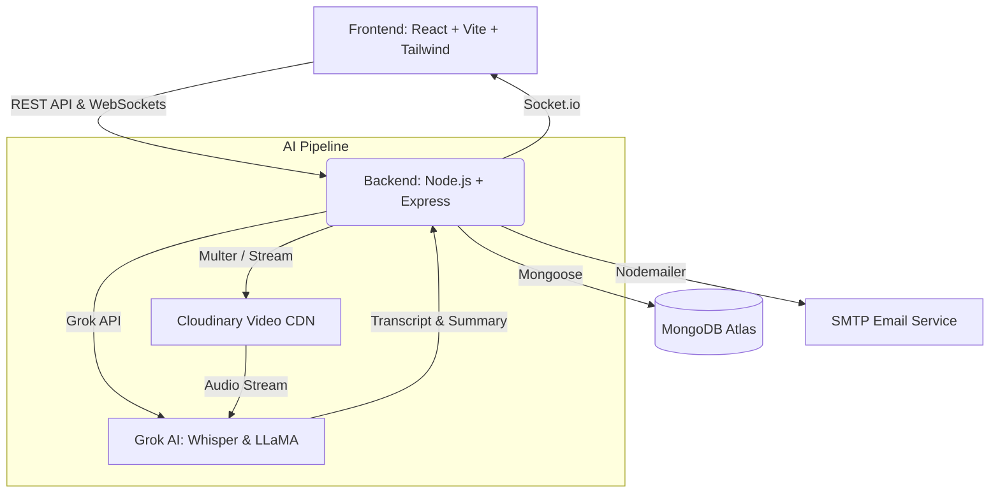

# SyncLoop ⚡


> The asynchronous video communication platform built for high-performance, distributed teams.

SyncLoop replaces endless live meetings with structured, asynchronous video threads. Record your updates, watch them on your own time, and let **Grok AI** automatically transcribe and summarize the key takeaways.

---

## ✨ Features

- **Asynchronous Video Threads:** Record webcam/screen updates. Watch replies in context.
- **Grok AI Integration:** Every video is automatically transcribed using `whisper-large-v3` and summarized with `llama-3.3-70b-versatile` via the Grok API.
- **Meeting Chat AI:** Ask the AI questions about the meeting ("What was the consensus on the new design?" or "List my action items").
- **Secure Workspaces:** Create private team workspaces, invite members, and maintain role-based access to meeting threads.
- **Threaded Discussions:** Deeply nested text comments on specific video replies.
- **Email Notifications:** Automated alerts sent to team members when a new update is posted.
- **Beautiful UI:** Built with Tailwind CSS and inspired by modern premium SaaS design.
- **Dark Mode:** Native, flicker-free dark mode support.

---

## 🏗️ Architecture

SyncLoop uses a modern, decoupled architecture. 



---

## 🛠️ Tech Stack

### Frontend
- **Framework:** React 19 + Vite
- **Routing:** React Router v7
- **Styling:** Tailwind CSS v3
- **State Management:** React Hooks + LocalStorage
- **Data Visualization:** Recharts
- **Real-time:** Socket.io-client

### Backend
- **Server:** Node.js + Express
- **Database:** MongoDB + Mongoose
- **Authentication:** JWT + bcryptjs
- **Media Storage:** Cloudinary
- **AI Processing:** Grok SDK
- **Testing:** Jest + Supertest

---

## 🚀 Getting Started

### Prerequisites
- Node.js (v18+)
- MongoDB Atlas URI
- Cloudinary Account
- Grok API Key

### Local Setup

**1. Clone the repository**
```bash
git clone https://github.com/vineet765245/syncloop.git
cd syncloop
```

**2. Setup Backend**
```bash
cd backend
npm install
```
Create a `.env` file in the `backend` directory:
```env
PORT=5000
MONGODB_URI=your_mongodb_connection_string
JWT_SECRET=your_jwt_secret
CLOUDINARY_CLOUD_NAME=your_cloud_name
CLOUDINARY_API_KEY=your_api_key
CLOUDINARY_API_SECRET=your_api_secret
GROQ_API_KEY=your_grok_api_key
EMAIL_USER=your_email@gmail.com
EMAIL_PASS=your_app_password
```
Start the server:
```bash
npm start
```

**3. Setup Frontend**
```bash
cd ../frontend
npm install
npm run dev
```

The app will be available at `http://localhost:5173`.

---

## 🧪 Testing

The backend includes a comprehensive Jest test suite covering authentication, authorization, and core application logic.

```bash
cd backend
npm test
```

---

## 📦 Deployment

SyncLoop is fully configured for modern PaaS deployment.

- **Frontend (Vercel):** The repository includes a `vercel.json` configured for Vite client-side routing. Simply import the repository into Vercel.
- **Backend (Render):** The repository includes a `render.yaml` blueprint. Connect Render to your GitHub for automatic Node.js provisioning.

---

## 🤝 Contributing

Contributions, issues, and feature requests are welcome! Feel free to check the [issues page](https://github.com/vineet765245/syncloop/issues).

---

Built with ❤️ by [Vineet Kumar](mailto:vineet765245@gmail.com).
